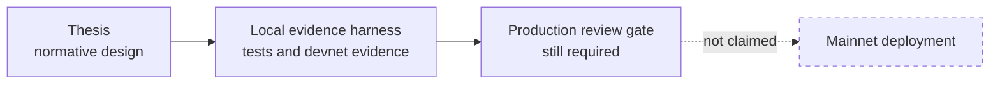
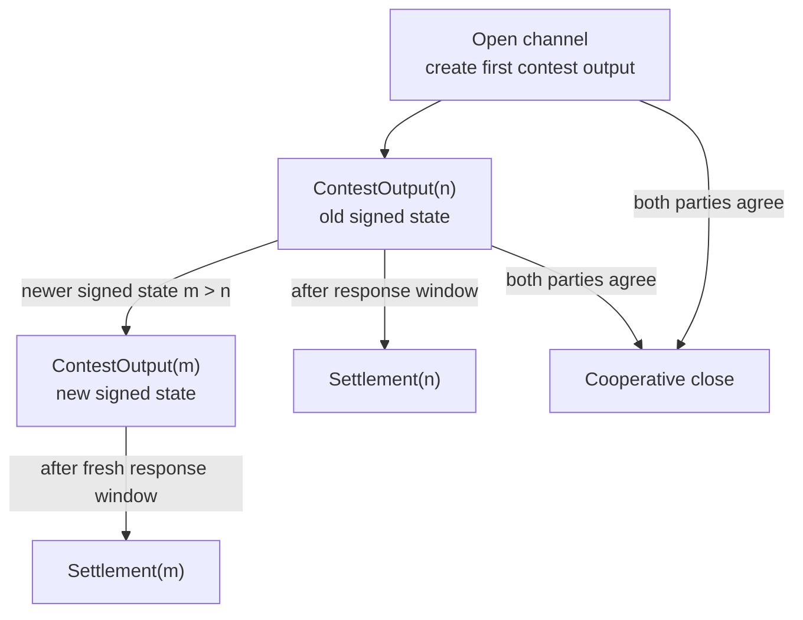
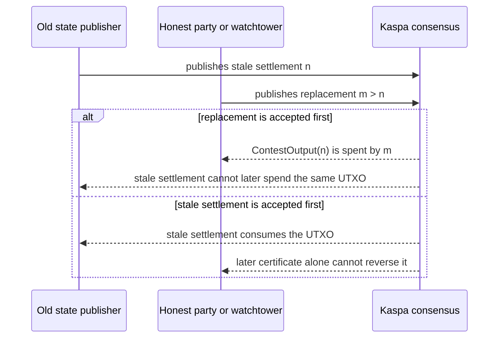
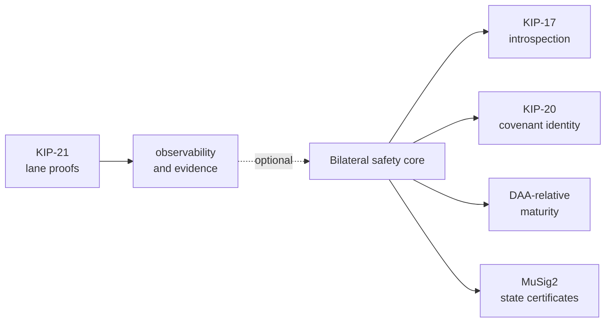
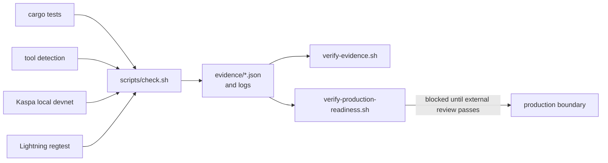

# Kurrent

Kurrent is a research project for a Kaspa-native latest-state channel.

The idea is simple: two participants keep updating a channel off-chain, and the
chain should only let the latest authorised state win, as long as an honest
party publishes that replacement before an older settlement lands.

Kurrent does not copy Bitcoin eltoo byte-for-byte. Bitcoin eltoo depends on a
floating transaction mechanism. Kurrent asks whether the same latest-state
discipline can be expressed with Kaspa's post-Toccata covenant tools: script
introspection, covenant identity, and DAA-relative sequence maturity.

## Read This First

This repository is a research specification plus a local evidence harness. It is
not a mainnet deployment and it is not a production-ready wallet or node.



| Surface | What it means | Current status |
| --- | --- | --- |
| Thesis | The bilateral channel design in `docs/KURRENT_THESIS.tex` and `docs/KURRENT_THESIS.pdf`. | Research specification. |
| Local harness | Rust tests, local-devnet flows, and generated evidence in this repo. | Useful prototype evidence. Not the final contest-output graph. |
| Production | A live public Kaspa deployment. | Not claimed. |

Start with the thesis:

- [Thesis PDF](docs/KURRENT_THESIS.pdf)
- [Thesis source](docs/KURRENT_THESIS.tex)

## The Channel In Plain English

Kurrent has one live channel UTXO under dispute. The thesis calls it the
**contest output**.

Each contest output represents a signed channel state. A newer signed state can
replace an older one immediately. The older state can settle only after a
DAA-relative waiting period.



The safety rule is intentionally conditional:



That is why Kurrent is **non-confiscatory**, not watch-free. Old states are not
punished by taking funds away. They become ineligible only if a higher
authorised state is accepted in time.

## What The Thesis Specifies

The thesis focuses on the bilateral contest-output channel. The current design
uses:

- a P2SH-authenticated state carrier;
- KIP-20 covenant identity for the channel lineage;
- KIP-17 transaction and sequence introspection;
- DAA-relative sequence maturity for the response window;
- MuSig2 aggregate authorisation for state certificates;
- settlement masks so one-sided terminal states do not need zero-valued outputs;
- Toccata transaction version `TX_VERSION_TOCCATA = 1`.

KIP-21 is useful for observability, watchtowers, evidence, future factories, and
future proof systems. It is not treated as the bilateral fund-safety primitive.



## What The Repository Demonstrates

The local harness checks the model and produces evidence. It helps answer:

- do the Rust protocol objects enforce the intended invariants?
- does the local Kaspa devnet expose the covenant-era surface Kurrent expects?
- can the prototype evidence path show replacement, settlement eligibility, and
  fee-sponsored displacement?
- do the Lightning, refund, factory, and evidence-verifier flows still compose
  in the local test environment?

It does **not** prove that the final production channel is deployed.



## Quickstart

Run the local acceptance gate:

```sh
./scripts/check.sh
```

This writes the acceptance report and logs under `evidence/`:

- `evidence/kurrent-acceptance.json`
- `evidence/acceptance-logs/latest.log`
- timestamped logs under `evidence/acceptance-logs/`

Useful replay commands:

```sh
cargo test
./scripts/detect-tools.sh
./scripts/check.sh
./scripts/verify-evidence.sh
```

To choose the full-log path:

```sh
KURRENT_ACCEPTANCE_LOG_PATH="$PWD/evidence/acceptance-logs/manual-local-devnet.log" ./scripts/check.sh
```

`prepare-devnet-tools` uses the normal Git proxy environment by default. If a
local stale proxy must be bypassed, run it with `KURRENT_BYPASS_GIT_PROXY=1`.

For a more readable end-to-end local-devnet run:

```sh
cargo run --quiet --bin run-devnet-tests
```

That command prints each workflow purpose, proof point, command result, output,
and evidence snapshot directly to the terminal.

`verify-evidence.sh` is commit-bound. If the source revision changes, regenerate
local acceptance with `./scripts/check.sh` before expecting verification to pass.

## Kaspa Checkout Requirement

For local evidence generation, keep the sibling `rusty-kaspa` checkout on
current `origin/master` at or after `9fdbaf1b`.

Stale `origin/toccata` checkouts are rejected by:

```sh
cargo run --quiet --bin kurrentctl -- detect-tools
```

The thesis assumes the Toccata-mainnet surface: KIP-17 introspection, KIP-20
covenant context, DAA-relative sequence maturity, and the KIP-21 RPCs used by
the local observability harness.

## Production Readiness

Kurrent does not claim production readiness.

The production gate is stricter than local acceptance:

```sh
./scripts/verify-production-readiness.sh
```

A production claim needs, at minimum:

- a target Kaspa profile with the required covenant and introspection surface;
- a pinned `rusty-kaspa` source revision satisfying the Toccata-mainnet RPC
  capability gate;
- a concrete contest-output transaction graph implementation;
- precise production script byte layout;
- monitoring and fee-inclusion assumptions for the response window;
- key-management, recovery, and rollout procedures;
- adversarial soak testing;
- independent external security review.

Useful production-evidence commands:

```sh
cargo run --quiet --bin kurrentctl -- write-production-target-profile
cargo run --quiet --bin kurrentctl -- run-semantic-transaction-verifier
cargo run --quiet --bin kurrentctl -- run-adversarial-soak
cargo run --quiet --bin kurrentctl -- verify-presentation-reality
cargo run --quiet --bin kurrentctl -- prepare-security-review-package
```

## Repository Map

Most readers should only need these documents:

- `docs/KURRENT_THESIS.pdf` - current research note.
- `docs/KURRENT_THESIS.tex` - source for the thesis.
- `docs/KURRENT_SECURITY_ASSUMPTIONS.md` - prototype evidence assumptions.
- `docs/KURRENT_PRODUCTION_ACCEPTANCE.md` - production acceptance criteria.
- `docs/PRODUCTION_SECURITY_REVIEW.md` - security-review brief.
- `docs/PRODUCTION_KEY_MANAGEMENT.md` - key-management runbook.
- `docs/PRODUCTION_MONITORING.md` - monitoring and alerting runbook.
- `docs/PRODUCTION_RECOVERY.md` - incident recovery runbook.
- `docs/PRODUCTION_ROLLOUT.md` - rollout and rollback runbook.

Design notes that are not the current bilateral channel spec:

- `docs/KURRENT_FACTORY_COMMITMENT_DESIGN.md`
- `docs/KURRENT_INVOICE_DESIGN_RESEARCH.md`

Primary evidence outputs live under `evidence/`. Treat them as local-devnet
supporting material, not as production proof.

## Suggested Reading Paths

For protocol review:

1. Read `docs/KURRENT_THESIS.pdf`.
2. Read the status boundary in this README.
3. Check `docs/KURRENT_SECURITY_ASSUMPTIONS.md`.
4. Use evidence files only as local-devnet support.

For implementation work:

1. Ensure `../rusty-kaspa` is on current `origin/master`.
2. Run `cargo run --quiet --bin kurrentctl -- detect-tools`.
3. Run `./scripts/check.sh`.
4. Inspect `evidence/kurrent-acceptance.json`.
5. Run `./scripts/verify-evidence.sh`.
6. Run `./scripts/verify-production-readiness.sh` to see which gates remain
   blocked.

## Non-Claims

Kurrent does not currently claim:

- mainnet readiness;
- production readiness;
- unattended operation;
- public Lightning route-hop integration;
- production compressed-factory commitments;
- that KIP-21 ordering is required for bilateral fund safety;
- that monitoring can be skipped;
- that stale settlement can be reversed after it is accepted first.

Treat the project as a research specification with a local evidence harness.
