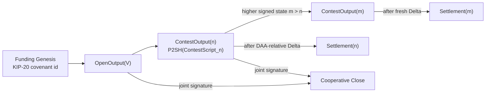

# Kurrent

Kurrent is a research project for a Kaspa-native latest-state channel.

The core idea is simple: two participants update a channel off-chain, and the
base layer should only let the latest valid state settle, provided the honest
party publishes the replacement before the stale state settles.

Kurrent does not copy Bitcoin eltoo byte-for-byte. Eltoo relies on Bitcoin's
floating transaction idea. Kurrent instead asks whether the same latest-state
discipline can be expressed with Kaspa's post-Toccata covenant and transaction
introspection surface.

The current thesis specifies that channel as a **non-confiscatory contest-output
protocol**. Old states are not punished by taking funds away. They become
ineligible if a higher authorised state is accepted in time.

## Current Status

This repository has two layers. Keep them separate when reading results.

| Layer | What it is | Status |
| --- | --- | --- |
| Normative bilateral channel | The protocol specified in `docs/KURRENT_THESIS.tex` and `docs/KURRENT_THESIS.pdf`. | Research specification. Not a production deployment claim. |
| Prototype evidence harness | The local-devnet code and evidence scripts in this repository. | Local evidence harness. It is not the final contest-output transaction graph. |
| Mainnet / production | A live deployment on public Kaspa infrastructure. | Not claimed. |

The latest thesis version is the best entry point:

- [Thesis source](docs/KURRENT_THESIS.tex)
- [Thesis PDF](docs/KURRENT_THESIS.pdf)

## The Protocol In Plain English

Kurrent uses one live channel UTXO, called the **contest output**. That output
carries a KIP-20 covenant identity and pays to a P2SH script that commits to the
state it represents.

Each contest state authenticates:

- the state number `n`;
- the signed state root;
- the settlement-output presence mask;
- the fixed channel parameters;
- the aggregate MuSig2 verification key;
- the response window `Delta`.

A higher state can replace a lower contest output immediately. Settlement of the
current contest output is delayed by a DAA-relative sequence maturity window.

That gives the actual stale-state theorem:

> If a higher authorised replacement is accepted before the stale settlement is
> accepted, ordinary UTXO uniqueness prevents that stale settlement from later
> being accepted in the same finality-respecting view.

The protocol does **not** give a magical state-number priority after maturity.
If stale settlement is accepted first, the higher certificate alone does not
reverse it. Monitoring and timely inclusion remain part of the security model.

## What Changed In The Thesis

The thesis now treats the bilateral channel as the main protocol and moves the
marker / KIP-21 path into prototype evidence and observability.

Important design points:

- **P2SH-authenticated state carrier**: every `ContestOutput(n)` pays to
  `P2SH(ContestScript_n)`, and `ContestScript_n` contains `n`, `state_root_n`,
  and `settlement_mask_n` as authenticated script constants.
- **Settlement mask**: terminal states that pay all funds to one participant do
  not need zero-valued outputs. The mask selects whether the settlement emits A,
  B, or both.
- **Funding Genesis**: the KIP-20 covenant genesis transaction is now the base
  case for the singleton-lineage argument.
- **Toccata byte alignment**: the thesis distinguishes the signed
  `commitSPK(...)` encoding from Toccata's actual `OpTxOutputSpk` byte form,
  `toccataSPK(...) = be16(version) || script`.
- **KIP-21 is not a fund-safety gate**: partitioned sequencing remains valuable
  for watchtowers, evidence, factories, and future proof systems, but the
  bilateral contest-output channel does not require an accepted-ordering surface
  for its fund-safety argument.

## Protocol Sketch



The safety argument is intentionally conditional:

- replacement is immediately eligible;
- settlement is delayed;
- the higher state wins only if the replacement spend is accepted first;
- once accepted and finalised under the deployment policy, the old contest UTXO
  is spent and cannot also settle.

## What This Repository Proves Locally

The repository currently provides a local evidence harness, not the final
production channel implementation.

The local harness exercises:

- Rust protocol objects and invariant tests;
- Kaspa covenant-era script capability checks;
- local Kaspa daemon relay and mining evidence;
- Lightning Network regtest invoice/preimage evidence;
- prototype state-channel update and settlement flows;
- lane-local KIP-21 monitoring evidence for the prototype path;
- fee-sponsored displacement evidence;
- factory, hashlock, refund, and evidence-verifier flows.

These artefacts are useful evidence, but they should not be confused with the
normative contest-output transaction graph specified in the thesis.

## Quickstart

Run the local acceptance gate:

```sh
./scripts/check.sh
```

This writes the aggregate acceptance report and logs under `evidence/`, including:

- `evidence/kurrent-acceptance.json`;
- `evidence/acceptance-logs/latest.log`;
- timestamped logs under `evidence/acceptance-logs/`.

To choose the full-log path:

```sh
KURRENT_ACCEPTANCE_LOG_PATH="$PWD/evidence/acceptance-logs/manual-local-devnet.log" ./scripts/check.sh
```

Useful replay commands:

```sh
cargo test
./scripts/detect-tools.sh
./scripts/check.sh
./scripts/verify-evidence.sh
```

For a human-readable end-to-end local-devnet run suitable for presentation or review:

```sh
cargo run --quiet --bin run-devnet-tests
```

This is a screen-first presentation runner: it prints the workflow purpose,
business proof point, command result, command output, and evidence snapshot
directly to the terminal instead of writing a separate presentation `.log` file.
The artefacts under `evidence/` remain the audit trail; the investor-facing
presentation surface is the terminal output.

It runs formatting, clippy, tests, build, tool detection, the Kaspa and LN
devnets, all current live workflow evidence, aggregate evidence verification,
semantic transaction verification, adversarial soak testing, the presentation
reality verifier, and the production boundary check. The production-readiness
step is reported as a boundary when the independent external security review
evidence is still absent.

`verify-evidence.sh` is intentionally commit-bound. If the source revision has
changed, regenerate local acceptance with `./scripts/check.sh` before expecting
the verifier to pass.

## Production Readiness

Kurrent does not claim production readiness.

The production gate is stricter than the local acceptance gate:

```sh
./scripts/verify-production-readiness.sh
```

A production claim would require, at minimum:

- a target Kaspa profile with the required covenant and introspection surface;
- a concrete contest-output transaction graph implementation;
- precise production script byte layout;
- monitoring and fee-inclusion assumptions for the response window;
- key-management, recovery, and rollout procedures;
- adversarial soak testing;
- independent security review.

Useful production-evidence commands:

```sh
cargo run --quiet --bin kurrentctl -- write-production-target-profile
cargo run --quiet --bin kurrentctl -- run-semantic-transaction-verifier
cargo run --quiet --bin kurrentctl -- run-adversarial-soak
cargo run --quiet --bin kurrentctl -- verify-presentation-reality
cargo run --quiet --bin kurrentctl -- prepare-security-review-package
```

## Target Surface

The thesis targets the post-Toccata Kaspa covenant direction:

- KIP-17 transaction and sequence introspection;
- KIP-20 covenant IDs and authorised-output context;
- Toccata transaction version `TX_VERSION_TOCCATA = 1`;
- `OpTxOutputSpk`, `OpOutputCovenantId`, `OpOutputAuthorizingInput`;
- `OpCheckSigFromStack` for script-visible Schnorr verification;
- DAA-relative sequence maturity.

KIP-21 is treated as an observability and proof surface, not as the bilateral
fund-safety primitive.

## Repository Map

Key documents:

- `docs/KURRENT_THESIS.pdf` - current research note.
- `docs/KURRENT_THESIS.tex` - source for the thesis.
- `docs/KURRENT_FACTORY_COMMITMENT_DESIGN.md` - boundary for current full-state factory evidence versus future compressed factory commitments.
- `docs/KURRENT_INVOICE_DESIGN_RESEARCH.md` - non-normative invoice design research.
- `docs/KURRENT_SECURITY_ASSUMPTIONS.md` - prototype evidence assumptions.
- `docs/KURRENT_PRODUCTION_ACCEPTANCE.md` - production acceptance criteria.
- `docs/PRODUCTION_SECURITY_REVIEW.md` - security-review brief.
- `docs/PRODUCTION_KEY_MANAGEMENT.md` - key-management runbook.
- `docs/PRODUCTION_MONITORING.md` - monitoring and alerting runbook.
- `docs/PRODUCTION_RECOVERY.md` - incident recovery runbook.
- `docs/PRODUCTION_ROLLOUT.md` - rollout and rollback runbook.

Primary evidence outputs:

- `evidence/kurrent-acceptance.json`
- `evidence/acceptance-logs/latest.log`
- `evidence/tool-detection.json`
- `evidence/kaspa-simnet-probe.json`
- `evidence/kaspa-txscript-covenants.stdout.log`
- `evidence/ln-devnet-evidence.json`
- `evidence/kurrent-live-state-channel-evidence.json`
- `evidence/kurrent-live-lane-monitor-evidence.json`
- `evidence/kurrent-live-settlement-eligibility-evidence.json`
- `evidence/kurrent-live-fee-sponsored-displacement-evidence.json`
- `evidence/kurrent-live-factory-evidence.json`
- `evidence/production/target-profile.json`
- `evidence/production/semantic-transaction-verifier.json`
- `evidence/production/adversarial-model-soak.json`
- `evidence/production/presentation-reality.json`

## Reading Order

For protocol review:

1. Read `docs/KURRENT_THESIS.pdf`.
2. Check the status boundary in this README.
3. Inspect `docs/KURRENT_SECURITY_ASSUMPTIONS.md` for prototype-only evidence assumptions.
4. Treat `docs/KURRENT_INVOICE_DESIGN_RESEARCH.md` as future protocol research only.
5. Use the evidence files only as local-devnet support, not as production proof.

For implementation work:

1. Run `./scripts/check.sh`.
2. Inspect `evidence/kurrent-acceptance.json`.
3. Run `./scripts/verify-evidence.sh` against the freshly generated report.
4. Run the production-readiness script to see which gates remain blocked.

## Non-Claims

Kurrent does not currently claim:

- mainnet readiness;
- production readiness;
- unattended operation;
- public Lightning route-hop integration;
- production compressed-factory commitments;
- that KIP-21 ordering is required for bilateral fund safety;
- that monitoring can be skipped;
- that stale settlement can be reversed after it is accepted first.

The project is a research specification plus a local evidence harness. Treat it
accordingly.
